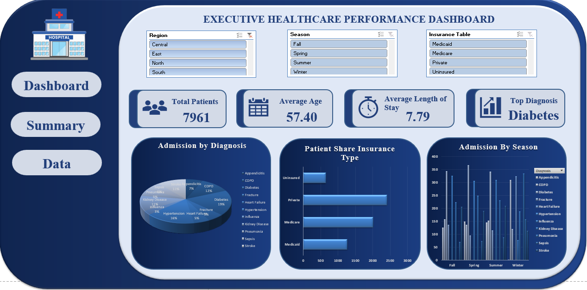

# Hospital Readmission Analysis Dashboard

An interactive Excel dashboard that explores hospital admissions and readmission risk across diagnoses, regions, insurance types, age groups and seasons. Built with Power Query, PivotTables, the Excel Data Model and slicers.



## Business questions

The analysis answers five questions a hospital operations team might ask:

1. Where should we focus clinical attention (which diagnoses carry the highest readmission risk)?
2. Which regions are driving admissions?
3. How does the payer (insurance) mix break down, and how does risk differ by payer?
4. Are older patients being discharged to appropriate care settings?
5. Is admission volume seasonal?

## Dataset

- **Source:** [add the dataset source or link here]
- **Size:** 8,010 records in the raw extract; 7,969 rows and 25 columns in the cleaned table (7,961 of them have a patient ID, which is the "Total Patients" figure on the dashboard)
- **Key fields:** admission date, season, age, region, diagnosis, insurance type, length of stay, discharge disposition, readmission risk score, readmission label

## Data cleaning

| Issue found | Fix |
|---|---|
| Age stored as text with stray characters in 18 records | Converted to clean numbers in Power Query |
| Implausible ages (raw values ranged from -5 to 250) | Corrected into a cleaned age column (`Final_Cleaned_Age`, range 5 to 95) and grouped into age bands |
| Messy season values (stray spaces, non-breaking spaces, invalid entries such as "Yes" and "No") | Standardised into `Cleaned Season` (Fall, Spring, Summer, Winter) |
| Region values | Standardised into `Cleaned_Region` (Central, East, North, South, West) |
| Leading spaces in the diagnosis and insurance lookup codes | Trimmed so the codes match the main data, then mapped to readable names (`Diagnosis Table`, `Insurance Table`) |

## Dashboard

The **Main Dashboard** sheet has three charts, all driven by three slicers:

- **Charts:** Admission by Diagnosis, Patient Share by Insurance, Admission by Season
- **Slicers:** Region, Season, Insurance Table

Click a slicer button and all three charts update together. Hold Ctrl to select several values, and use the clear-filter icon on a slicer to reset it.

> Open the file in **desktop Microsoft Excel**. Slicers and PivotTables do not work in GitHub's file preview or most web viewers.

## Key findings

Figures below come from the cleaned table (7,969 records).

**1. Focus on five high-risk diagnoses.** Heart Failure (0.88), COPD (0.87), Stroke (0.86), Sepsis (0.86) and Kidney Disease (0.85) have the highest average readmission risk scores, compared with 0.70 to 0.74 for the other six diagnoses. Sepsis also has the longest average stay (10.8 days). Diabetes and Hypertension are the highest-volume diagnoses (1,466 and 1,297 records) but among the lowest risk (about 0.70).

**2. The South drives admission volume, not risk.** The South has the most admissions (1,985, about a quarter of the total) and Central the fewest (1,230). Average risk scores are nearly identical across regions (0.77 to 0.78), so regional differences are about volume rather than severity.

**3. Medicare patients carry much higher risk.** Payer mix is Private 38.1%, Medicare 31.8%, Medicaid 20.0% and Uninsured 10.1%. Medicare patients have an average risk score of 0.96, versus 0.67 to 0.76 for the other payers.

**4. Discharge setting shifts sharply with age.** No patient aged 45 or over is discharged directly Home or to Rehab. They go to Home Health or Skilled Nursing, and the Skilled Nursing share rises with age: about 8% at 55 to 64, 29% at 65 to 74, 47% at 75 to 84, and 100% of patients aged 85 and over.

**5. Volume is flat across seasons, but the case mix is not.** Each season has roughly 2,000 admissions (Winter is highest at 2,034). However, Heart Failure, Influenza and Pneumonia appear only in Winter, and Fracture and Kidney Disease do not appear in Winter at all.

## Executive report

The [executive report (PDF)](Njemanze_Chinonso_Executive_Report_week2.pdf) summarises the findings for a non-technical audience and recommends three actions: review capacity and staffing in the South region, analyse bed use and discharge workflow for Heart Failure, Sepsis and Stroke (the longest stays), and expand post-discharge care coordination for the five highest-risk diagnoses. Its tables were built from the 8,010-record raw extract, so its counts differ slightly from the cleaned-table figures in this README and on the dashboard.

## Workbook guide

| Sheet | Purpose |
|---|---|
| Main Dashboard | Final dashboard with charts and slicers |
| Pivot | PivotTables that feed the dashboard charts |
| Five question sheets | One analysis per business question above |
| hospital final edit | Cleaned dataset used by the dashboard |
| Diagnosis Table, Insurance Table | Code-to-name lookup tables |
| hospital table unedit, hospital_readmission_dataset | Earlier versions of the data |

## Limitations

- The analysis is descriptive. It shows patterns, not causes.
- After cleaning, 8 records still have a blank patient ID (excluded from patient counts) and 9 patient IDs still appear more than once in the cleaned table.
- Risk scores come from the dataset and are not clinical guidance.

## Tools

Microsoft Excel (PivotTables, slicers, Data Model), Power Query

## Repository structure

```
├── README.md
├── Njemanze_Chinonso_Assignment_hospital_readmission_dataset_FIXED.xlsx
├── Njemanze_Chinonso_Executive_Report_week2.pdf
└── images/
    └── dashboard.png
```

## Author
Njemanze Chinosnso Reginald

Chinonso Njemanze - [LinkedIn](https://www.linkedin.com/in/chinonso-njemanze-18a3a640b/)
